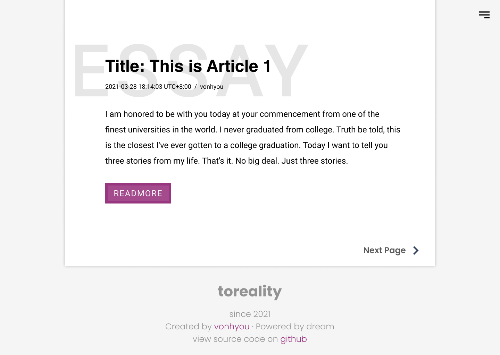

# blog `toreality`

progress: *Initializing a Rails project*

* Ruby version: 3.0.0p0 (2020-12-25 revision 95aff21468)

* Technology Stack (Intent): Vue.js + Rails

## Prototypes

The homepage

Index

Footer

Article page with a title

Article page with a footer